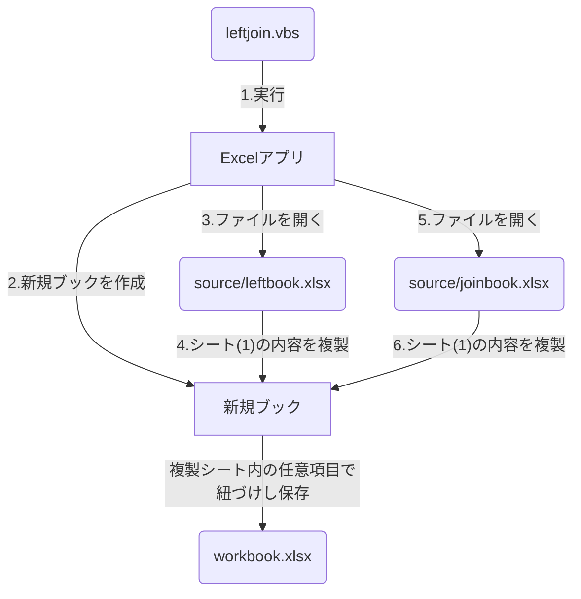

# leftjoin.vbs

## ファイル関係フロー図
※ 2ファイルのみの結合に対応しています  
=> source/ にのエクセルファイルを3つ以上格納した場合正常に動作しません  
※ 例として下図ではsource/のファイル名を指定していますが任意です  
=> 別途vbs内のconfig設定を変更してください


## テーブル結合

### SQL
```
SELECT * 
  FROM leftbook
  LEFT JOIN joinbook
  ON leftbook.other-id = joinbook.id;
```

### leftbook
| id | name | address | other-id |
|:-----------|:-----------|:-----------|:------------|
| 1 | Jhon | AAA | 101 |
| 2 | Mike | BBB | 203 |
| 3 | Rin | CCC | 101 |
| 4 | Nick | DDD | 255 |
| 5 | Anya | EEE | 69 |

### joinbook
| id | other-name | remarks |
|:-----------|:-----------|:-----------|
| 69 | XXX | Remark~X |
| 101 | YYY | Remark~Y |
| 203 | ZZZ | Remark~Z |
| 255 | WWW | Remark~W |

### workbook
| id | name | address | other-id | other-name | remarks |
|:-----------|:-----------|:-----------|:------------|:-----------|:-----------|
| 1 | Jhon | AAA | 101 | YYY | Remark~Y |
| 2 | Mike | BBB | 203 | ZZZ | Remark~Z |
| 3 | Rin | CCC | 101 | YYY | Remark~Y |
| 4 | Nick | DDD | 255 | WWW | Remark~W |
| 5 | Anya | EEE | 69 | XXX | Remark~X |
